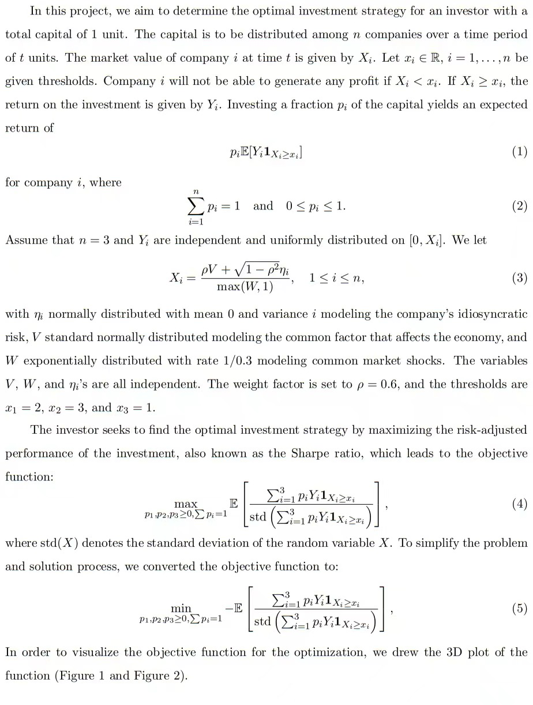
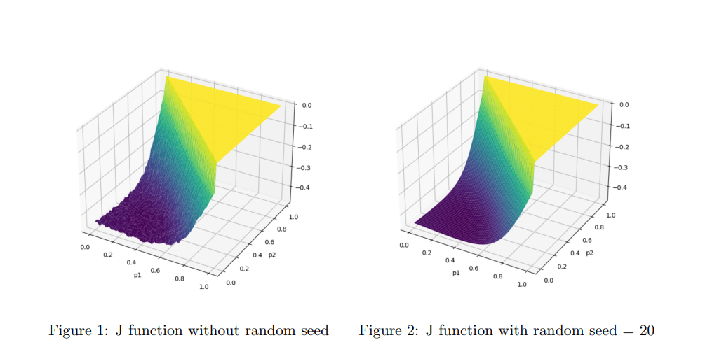
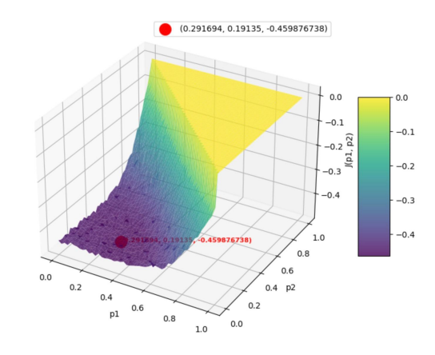
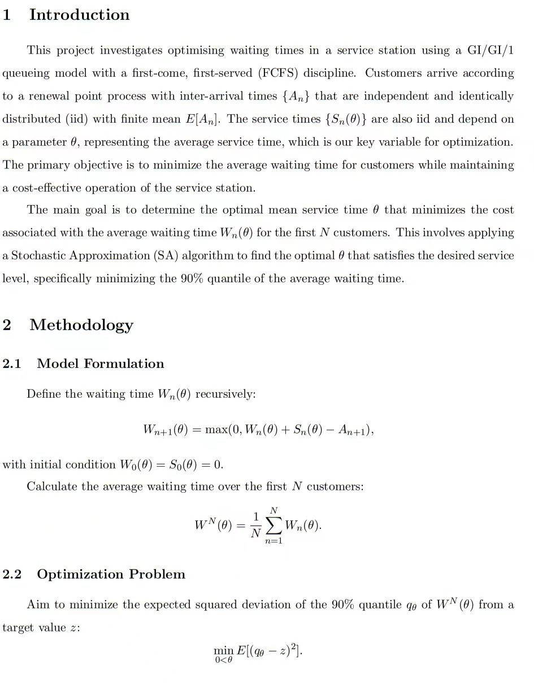
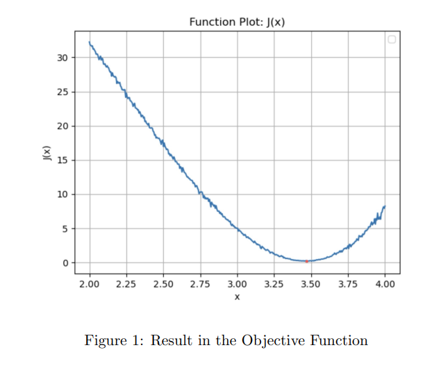

# Simulation-Project
This project uses Stochastic Approximation to estimate the gradient of complicate functions. And use the estimated gradient to do the optimization and solve the real world problems. 
(For queuing system and investment optimization)
And this project is from PKU GLOBEX PROGRAMME Prof.Bernd HEIDERGOTT's course Simulation Methods for Optimization and Learning.
At least, sincerely thanks my team mates:Cui Gehao, Han Yufeng, Lie Bob Jesse, Yuan Huan.

Stochastic Approximation:
#  **Simultaneous Perturbation Stochastic Approximation (SPSA)**

We revisit the analysis of the two-sided FD scheme in the \( d \)-dimensional setting.

Let $\( c_n = \eta_n \Delta_n \)$, where $\( \eta_n \)$ is a scalar and $\( \Delta_n \)$ is a random vector such as $\( \{\Delta_n\} \)$ is an iid sequence, with $\( \Delta_n(k) \)$ as well as $\( 1/\Delta_n(k) \)$ being bounded, symmetric around zero, and the components of $\( \Delta_n(k) \)$ are mutually independent.

- A standard choice is 

$\[
P(\Delta_n(i) = -1) = \frac{1}{2} = P(\Delta_n(i) = 1),
\]$

for all $\( i, n \)$.

- Let 

$\[
(\nabla J^{SPSA}(\theta_n))_i = \frac{J(\theta_n + \eta_n \Delta_n) - J(\theta_n - \eta_n \Delta_n)}{2 \eta_n \Delta_n(i)},
\]$

for $\( 1 \leq i \leq d \)$.

- Note that $\( \nabla J^{SPSA} \)$ requires only two evaluations of $\( J \)$ for evaluating approximately the entire gradient of size $\( d \)$ for arbitrary $\( d \)$.

This method is called **Simultaneous Perturbation Stochastic Approximation (SPSA)**.

# Description of the problem 1:

# Description of problem 2:

